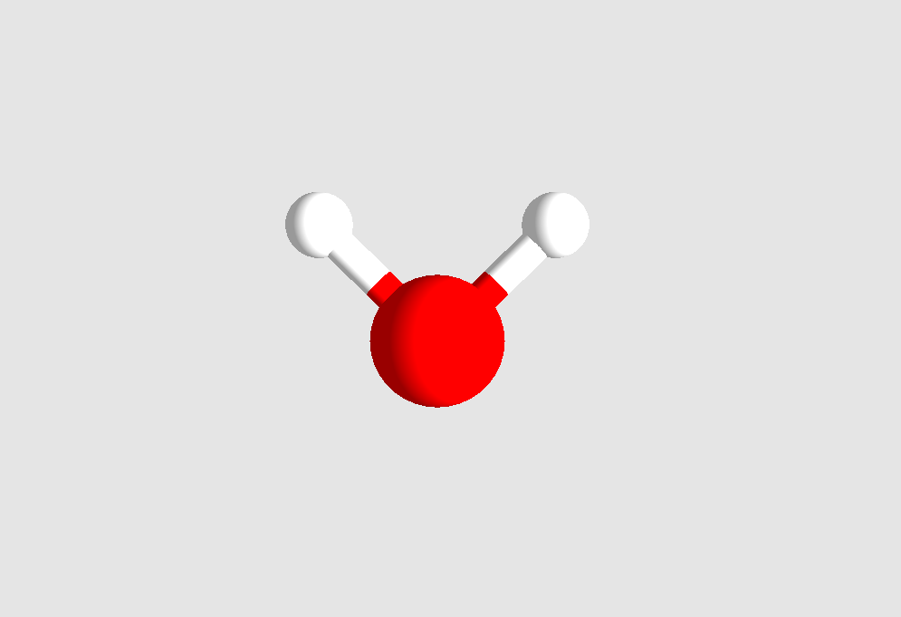

# Atoms
A simple OpenGL program that visualizes molecules and configurations of atoms.

## Requirements
GLEW: http://glew.sourceforge.net/

GLM: https://github.com/g-truc/glm

GLFW: https://www.glfw.org/

## Controls
WASD + mouse controls implemented currently.

Click & drag camera rotation yet to be implemented.

## Usage
The molecule or configuration of atoms must be stored in the .xyz format. This is a human-readable, plain-text format with the following template:

`number of atoms`

`comment line, ignored`

`chemical symbol     x   y   z`

`chemical symbol     x   y   z`

`...`

Once the input file is provided, the atomic structure / molecule is visualized.

## Example
Water molecule (file H2O.xyz):

`3`

`  `

`H  0.7  0.7  0.0`

`O  0.0  0.0  0.0`

`H -0.7  0.7  0.0`

Benzene molecule (file benzene.xyz:

`12`

`  `

`  C        0.00000        1.40272        0.00000`

`  H        0.00000        2.49029        0.00000`

`  C       -1.21479        0.70136        0.00000`

`  H       -2.15666        1.24515        0.00000`

`  C       -1.21479       -0.70136        0.00000`

`  H       -2.15666       -1.24515        0.00000`

`  C        0.00000       -1.40272        0.00000`

`  H        0.00000       -2.49029        0.00000`

`  C        1.21479       -0.70136        0.00000`

`  H        2.15666       -1.24515        0.00000`

`  C        1.21479        0.70136        0.00000`

`  H        2.15666        1.24515        0.00000`

