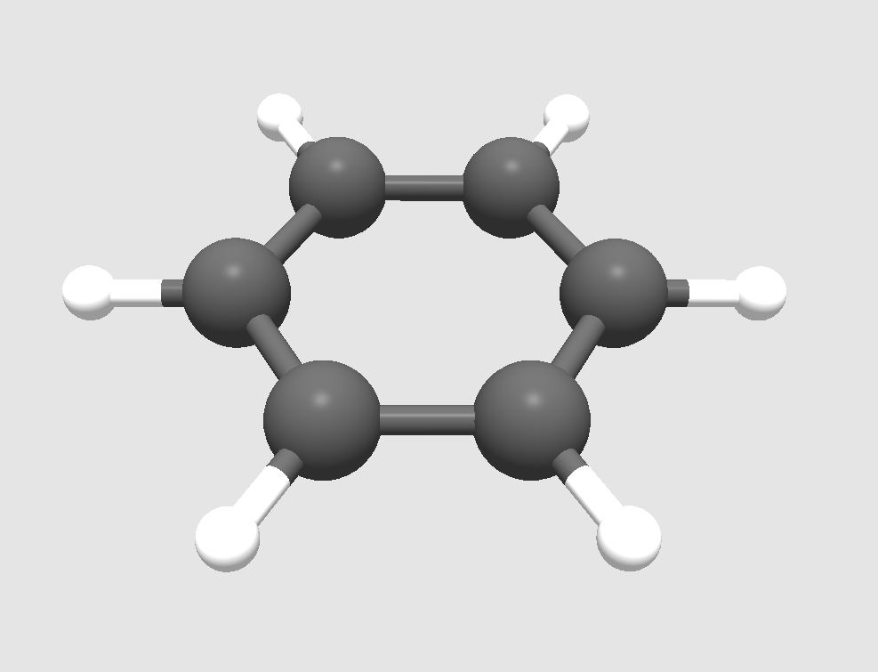
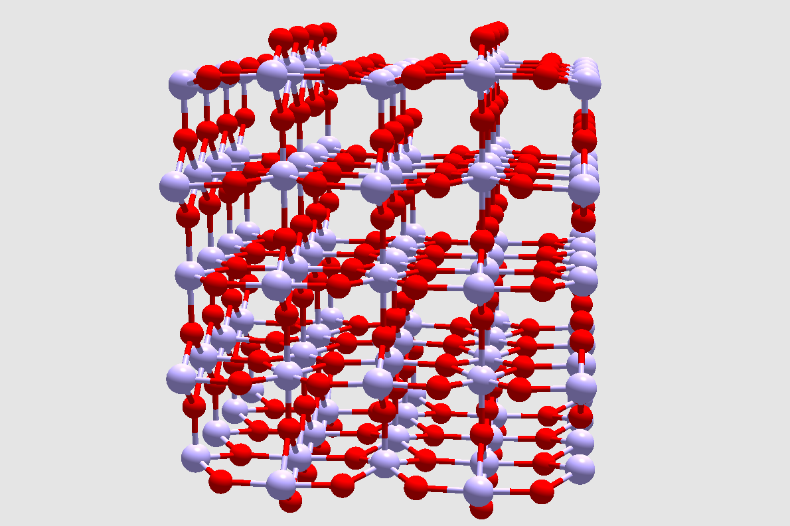

# Atoms
A simple OpenGL program that visualizes molecules and configurations of atoms.

## Requirements
GLEW: http://glew.sourceforge.net/

GLM: https://github.com/g-truc/glm/

GLFW: https://www.glfw.org/

## Controls
WASD to move up/left/down/right.

Click (left mouse button) & drag to rotate view.

## Usage
The molecule or configuration of atoms must be stored in the .xyz format. This is a human-readable, plain-text format with the following template:

`number_of_atoms`

`comment_line (ignored)`

`chemical_symbol     x   y   z`

`chemical_symbol     x   y   z`

`...`

The coordinates `x`, `y` and `z` are given in Angstrom. Once the input file is provided, the atomic structure / molecule can be visualized.

## Example
Benzene molecule (file Docs/benzene.xyz):

TiO2 crystal (file Docs/TiO2.xyz):

